1. Запустил wsl с бубунтой, начал добавлять mongo в список пакетов apt:
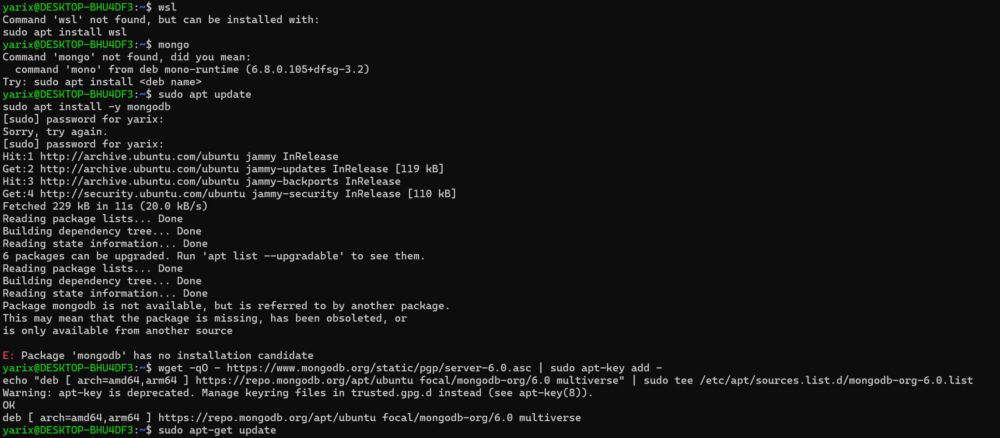

2. Первые костыли, для 22 убунты не подходит дефолтная ссылка на монгу из гугла, приходится разбираться:
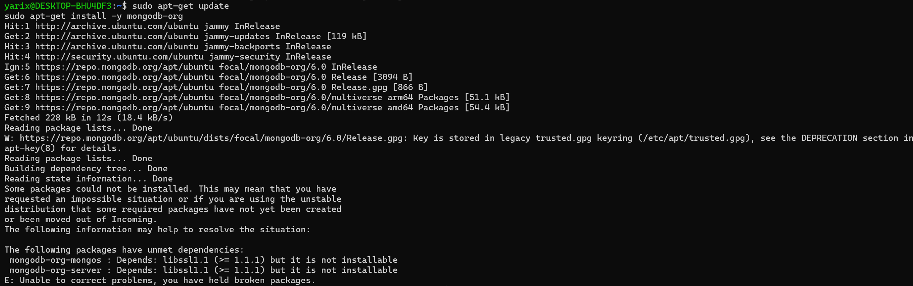 

3. Оказывается mongo 6.0 забилдили для убунты 22.04 только в декабре 22 года, приходится использовать jammy ссылку:
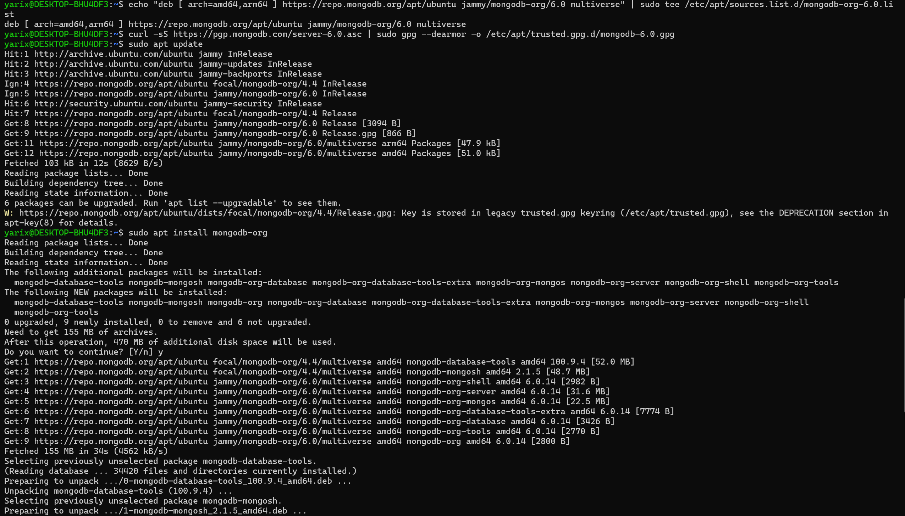

4. Аллилуя оно поставилось, прописываем sudo systemctl start mongod
sudo systemctl status mongod и начинаем упражнения с базой данных
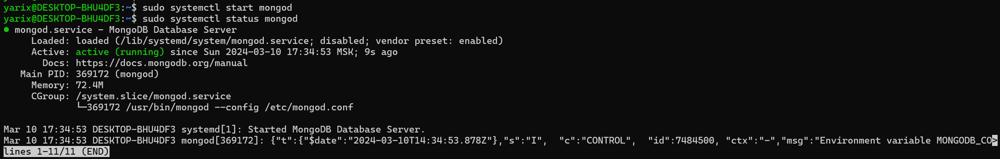

5. Скачаем данный датасет https://www.kaggle.com/datasets/decide-soluciones/air-quality-madrid?resource=download
И загрузим его в mongodb:
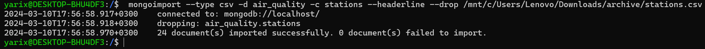

6. Используем CRUD команды
В Mongo 6.0 в отличие от обычного интерфейса mongo следует использовать утилиту mongosh:
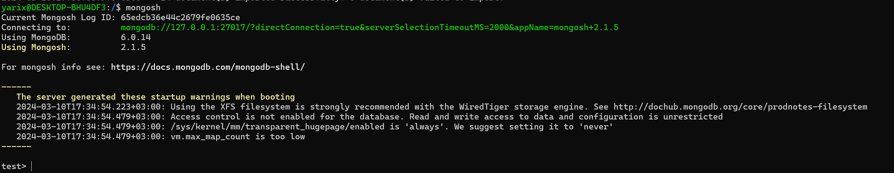

Импортируем несколько таблиц с помощью mongoimport:
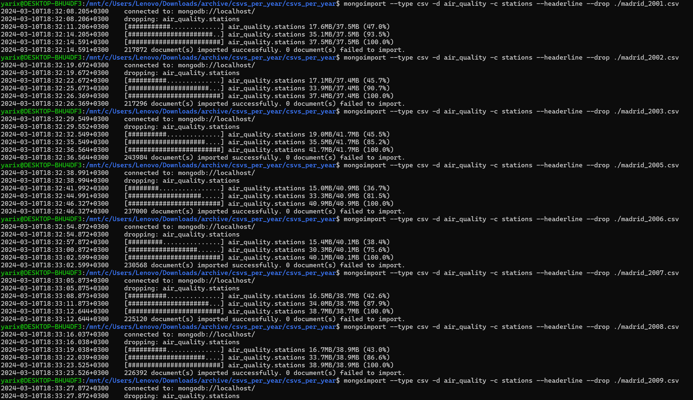

CRUD:
C - Create
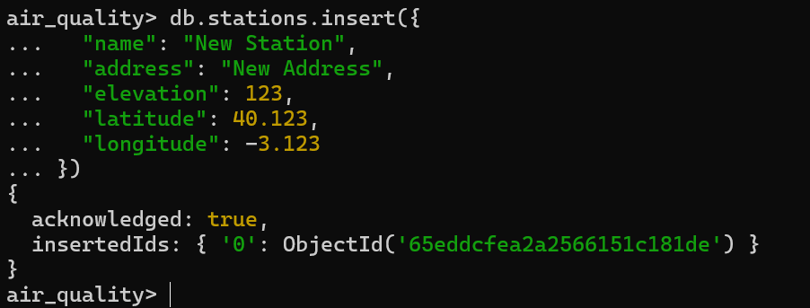
R - Read
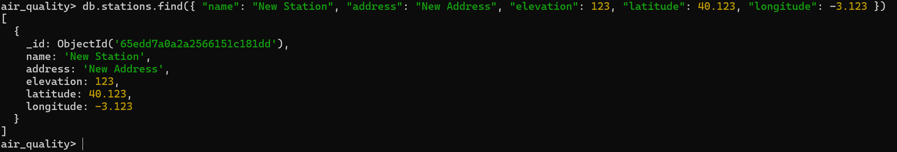
U - Update
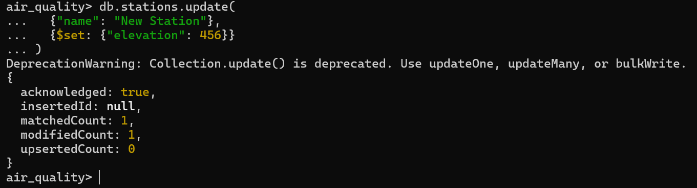
D - Delete
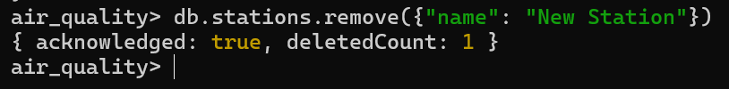

7. Перейдем к индексированию
Выберем значение через findOne:
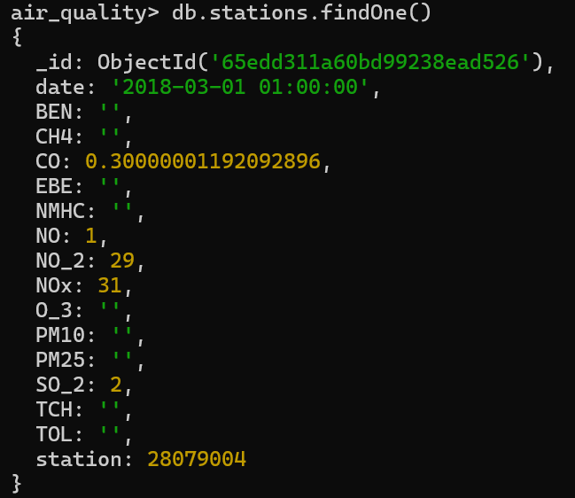

Его поиск занимает порядка 70 миллисекунд:
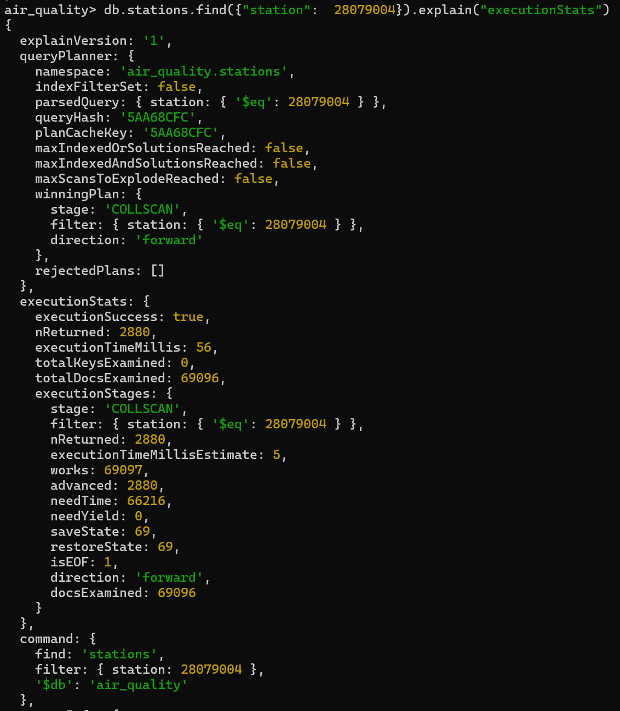

Создадим индекс и попробуем снова:
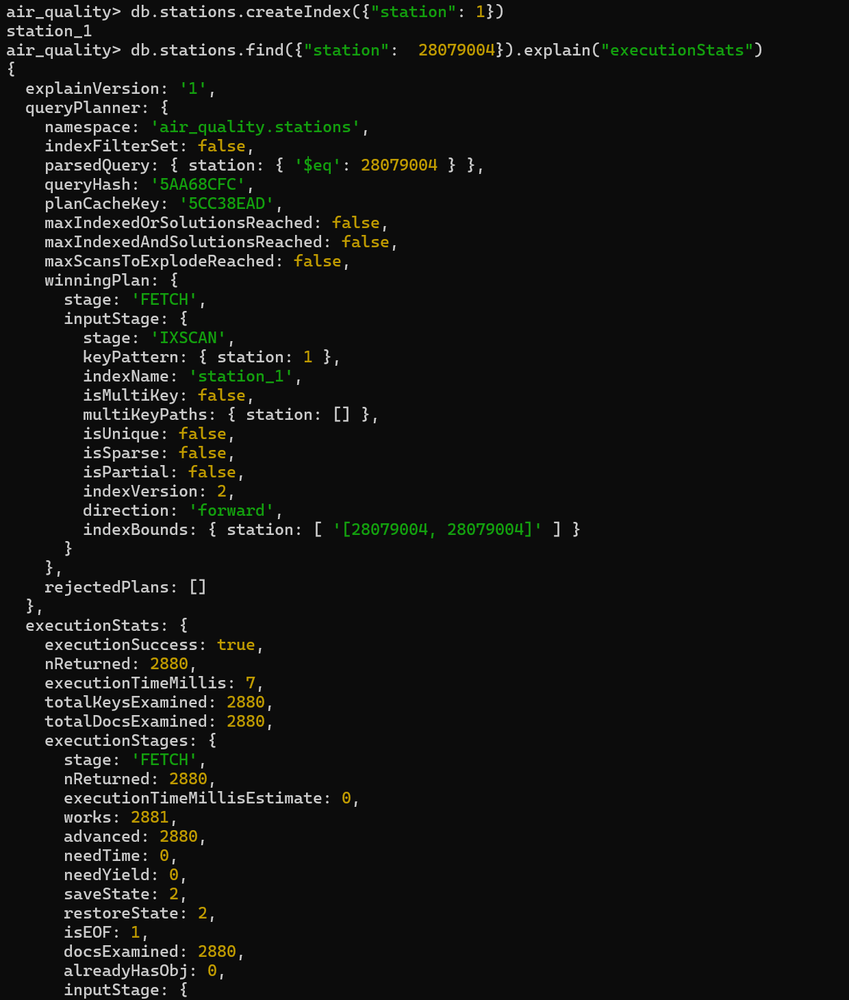
Ускорение более чем в 10 раз! (Sick!)