# Процесс установки и использования MongoDB в WSL Ubuntu 22.04

## 1. Запуск WSL с Ubuntu и начало установки MongoDB

Запустил WSL с Ubuntu и начал добавлять MongoDB в список пакетов apt:

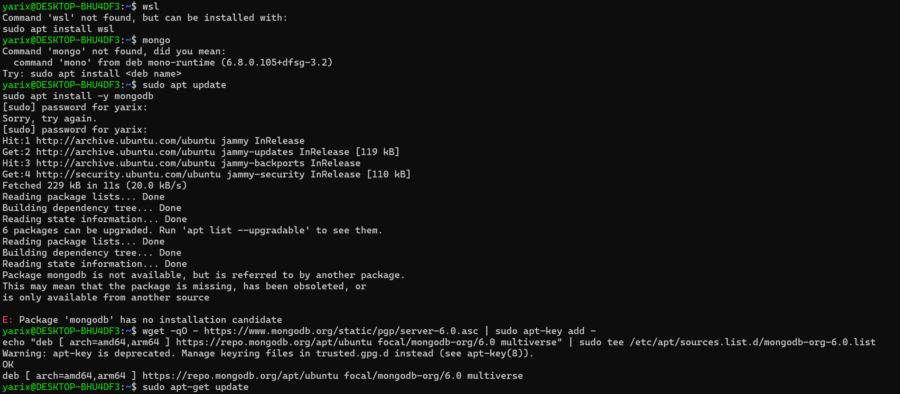

## 2. Адаптация под Ubuntu 22.04

Первые необходимые настройки для Ubuntu 22.04, поскольку дефолтная ссылка на MongoDB из репозиториев Google не подходит:

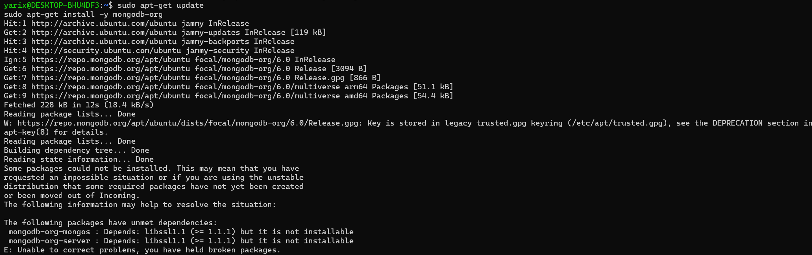

## 3. Использование специфичной версии MongoDB

Обнаружил, что MongoDB 6.0 была оптимизирована для Ubuntu 22.04 только в декабре 2022 года, использовал ссылку для jammy:

## 4. Установка MongoDB

Успешная установка MongoDB, запуск и проверка статуса сервиса:

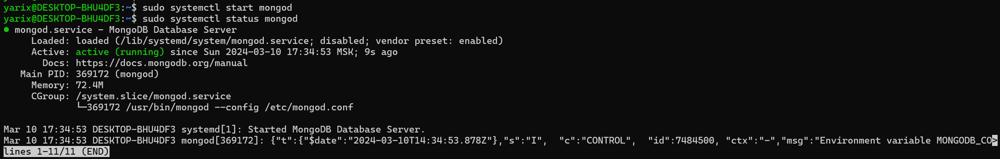

## 5. Скачивание и импорт датасета

Скачиваем и импортируем датасет качества воздуха в Мадриде:

[Ссылка на датасет](https://www.kaggle.com/datasets/decide-soluciones/air-quality-madrid?resource=download)

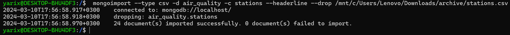

## 6. CRUD операции в MongoDB 6.0

В MongoDB 6.0 используется утилита mongosh для работы с базой:

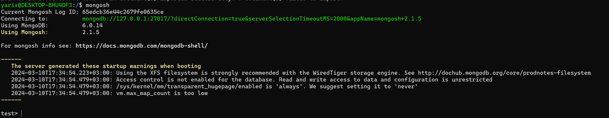

### CRUD действия:

- **C - Create (Создание):**

  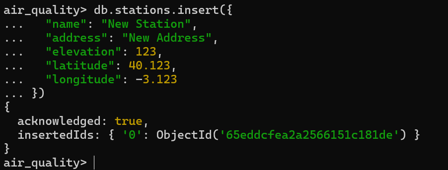

- **R - Read (Чтение):**

  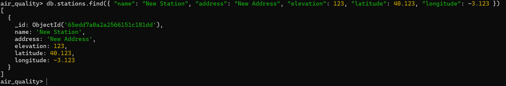

- **U - Update (Обновление):**

  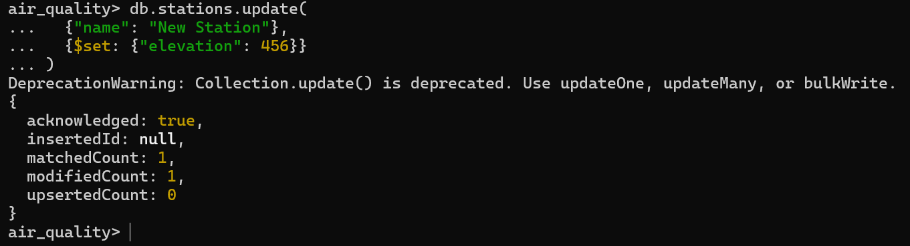

- **D - Delete (Удаление):**

  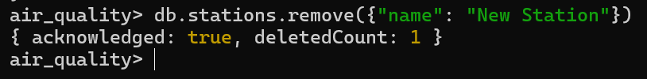

## 7. Индексирование и оптимизация запросов

Изначально возьмем какое нибудь значение через findOne

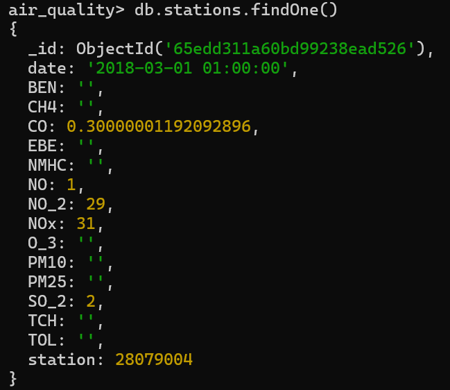

Проверка времени выполнения запроса до создания индекса:

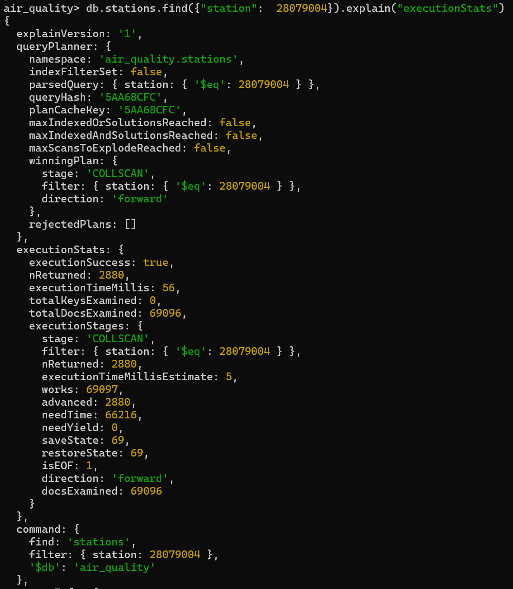

Создание индекса и повторный поиск для сравнения производительности:

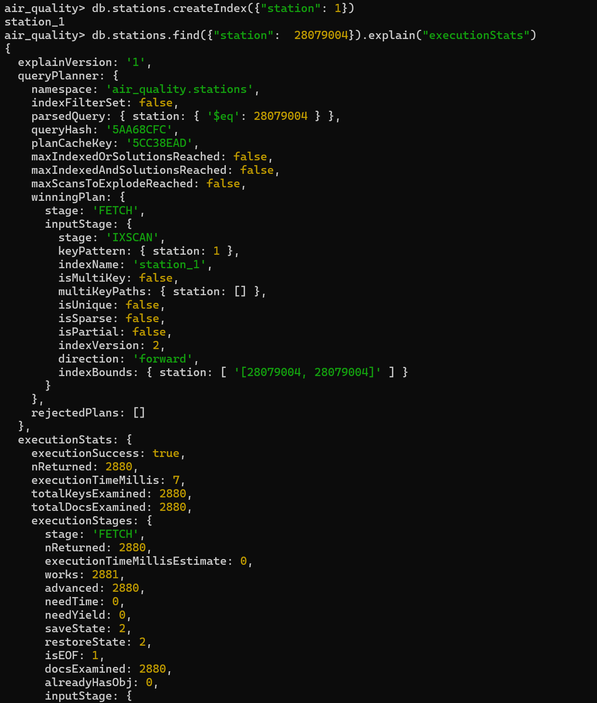

Ускорение поиска более почти в 10 раз демонстрирует эффективность индексирования
