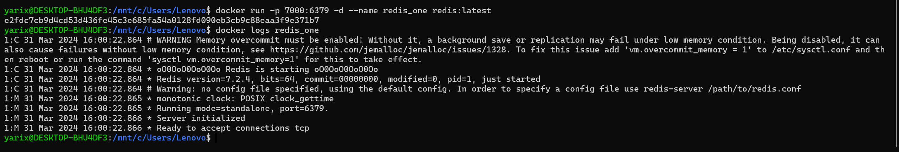

##1. Пропишем docker compose с 3 нодами и 3 репликациями для устойчивости

##2. Запустим их с помощью docker-compose up -d

3.Создаем кластера

Теперь подключимся к кластеру в python, также создадим отдельный redis контейнер для сравнения. Напишем бенчмарк на python для замера скорости и там и там.
4. отдельный redis:

5. Бенчмарк:

6. Разница в замерах между кластером и отдельным redis инстансом. Видно, что для кластера требуется больше времени, чтобы данные распределились по нодам
